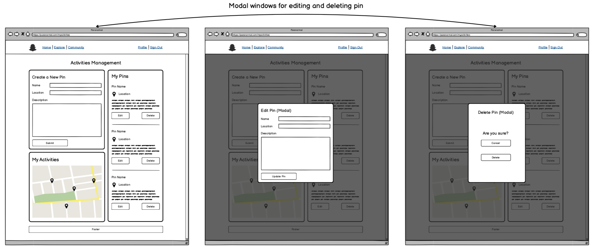

# Sydney Paranormal

### Links

GitHub repository: https://github.com/Nictordan

## Purpose

Currently there is a limited ability for those who have witnessed strange events to share their story, and connect with other's who might be burdened with a similar tale.

The purpose of this website is to make a centralised depository of supernatural events, where a user may log such activity, and search through the events logged by other users. Further corroborating sightings can be contributed for any given event, thereby strengthening the veracity of the claims made.

In addition for those seeking answers to their experiences, it is also suitable for those amateur investigators of the paranormal as a tool for staying updated.

## Functionality and Features

### Map
- The main function of the application will be a map where a user can place a pin on a given location, representing a paranomal sighting.

### Pins
- Each pin can be clicked on whereby a window will open revealing the details pertaining to that pin.

- Each window associated to a pin will have a list of notes representing a chronological list of sightings/events, which can be added to either by the initial poster of the pin, or by other users, subject to whether permissions are granted by the initial poster.

### Notes
- Each note listed within a pin can in turn be expanded where the user can write details describing the sighting, and can also a gallery including any drawings or photographs of the sighting they may have taken.

### Roleplaying functionality
- A user when first initialising a pin will be able to decide whether the pin will have open permission for contributing to the pin.

- A user who limits the permission for contributing to a pin will take on a moderating role, reminiscent to a 'dungeon master', whereby other users can contribute to the narrative of the pin subject to administrative approval.

### Narrative expansion
- An ability to link other pins (subject to the permissions of the other pins).

### Real time location 
- Using the user's location to notify them of any logged activity in the current area.

## Target audience

There are two primary, although not necessarily mutually exclusive, audiences. The initial audience consists of folk who have witnessed some type of paranormal activity. This application doesn't target those who for whatever reason have a large outreach, whether it be through tv or radio, rather it targets simple every day folk who have unwittingly stumbled into something that defies their day to day experiences. There currently does not exist any service which provides a systematic and streamlined way of getting their stories heard.

The other primary target consists of people who may not have actually witnessed anything paranormal directly themselves, but rather involved as keen investigators of the field. These can be ghost hunters, exorcists, cryptozoologists and renegade FBI agents searching for the truth out there.

## Tech Stack

- HTML: Markup language to structure a website.
- CSS: Markup language to style HTML content.
- JavaScript: Programming language to create interactivity in websites.
- ReactJS: A JavaScript framework for creating user interfaces.
- Styled Components: A framework for ReactJS that allows CSS code to be written within a JavaScript file.
- Material UI: A library for ReactJS created by Google with a view of standardising user interface layouts for consistency and accessibility.
- Mapbox: API for implementing interactive maps.
- Ruby on Rails: Back-end framework for the Ruby programming language.
- PostgreSQL: Relational database management system.
- Heroku: Deployment platform for the server side, which is the industry standard for a Ruby on Rails application.
- Netlify: Deployment platform for the client side of the application. 
- Git / GitHub: Technologies used for version control.
- Trello: Project management platform.

# Dataflow Diagram

# Application Architecture Diagram

# User Stories

- As a witness to something strange, I wish to be able to tell as many people about it as I can.
- As a witness to something strange, I wish to have a way of saving my story for posterity.
- As a witness to something strange, I want a way to see if other's have experienced the same thing, so I know I'm neither crazy, nor alone.
- As someone who is relying on the testimony of strangers to uncover something paranormal, I wish to have the ability to moderate who can contribute to my story, so that the investigation doesn't get derailed by nonsense.
- As an investigator of the paranormal, I wish there was a repository of paranormal events so that I have the best information to form my theories.
- As an investigator of the paranormal, I wish there was a repository of paranormal events which logged sightings in detail, so that I may know where I'm best to concentrate my efforts.
- As someone interested in a supernatural event, I wish there was a way for people to link similar sightings in different locations, so I may form a fuller picture.
- As a potential property owner, I wish to see all the information pertaining to the supernatural, on a given location so that I may avoid buying somewhere haunted.
- As someone who is terrified of bunyips I wish there was a way to take my location in real time and list any nearby sightings, so I may know which swimming holes are safe.
- As seller of cryptids, I wish to have the freshest trails, so that I may finally capture one of these creatures and save my failing business.
- As someone who has had strange visitors take them away in the night, I'd like to track down the entity or entities so I can ask some questions.
- As someone who's cat has gone missing, I'd like to see if there are any ghost cat sightings, so I may find out if anyone has seen my cat, even if not living.

# Wireframes

## Home Page

## Activities Management Page

## User Profile Page

## Edit User Profile Page

## Account Settings Page

## Log In Page

## Sign Up Page

# Trello Board

