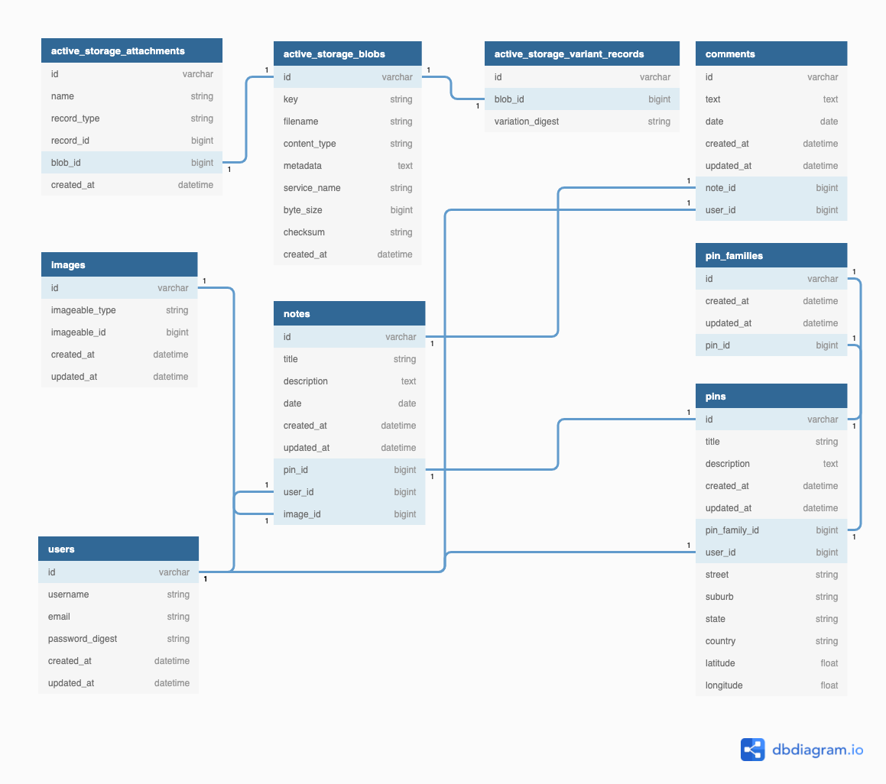

# Sydney Paranormal

A website to register the occurence of paranormal activities in the city of Sydney, Australia. 

## Links

Deployed app: https://sydney-paranormal.netlify.app/

GitHub Repository: https://github.com/Nictordan

## Local Setup Instructions - Backend

- Clone the `sydney-paranormal-api` repository.
- Run `$ gem install bundler` (if you don't have the package manager Bundler installed).
- Run `$ yarn install --check-files`
- Run `$ bundle` to install all of the required dependencies for the project, as described in the `Gemfile`.
- Make sure you have PostgreSQL installed as it is the database management system used in this project.
- Run `rake db:setup` to create a local database of the project and seed pre-defined data.
- Run `rails s -p 4000` to load the Rails server using port 4000. This is because the frontend is set to run at port 3000.
- In the browser, load `http://localhost:4000` to run the app.
- Finally, the code was written in Ruby 2.7.2 In case the project fails to load correctly because of a mismatch between versions, please make sure to use version 2.7.2. 

## Local Setup Instructions - Frontend

- Clone the `sydney-paranormal-client` repository.
- Run `yarn install`to install all of the required dependencies.
- Run `yarn start:local` to load the server.
- In the browser, load `http://localhost:3000` to run the app.

**Important**: The app uses Mapbox, an API for creating interactive maps. In order to load the map properly, it is necessary to obtain an API key from Mapbox; once you sign up a public key will be generated. In the React app, create a `.env` file in the root directory and insert the following line of code. 

```javascript
// make sure that there are no spaces between the = sign.
// do not include quotation marks around the API key.
REACT_APP_MAPBOX_KEY=your_api_key
```

A detailed explanation of how to work with the Mapbox platform, as well as customize the map, can be found further in the documentation.

---

## Purpose & Problem

Currently there is a limited ability for those who have witnessed strange events to share their story, and connect with other's who might be burdened with a similar tale. The purpose of this website is to make a centralised depository of supernatural events, where a user may log such activity, and search through the events logged by other users. Further corroborating sightings can be contributed for any given event, thereby strengthening the veracity of the claims made. In addition for those seeking answers to their experiences, it is also suitable for those amateur investigators of the paranormal as a tool for staying updated.

## User Stories

- As a witness to something strange, I wish to be able to tell as many people about it as I can.
- As a witness to something strange, I wish to have a way of saving my story for posterity.
- As a witness to something strange, I want a way to see if others have experienced the same thing, so I know I'm neither crazy, nor alone.
- As an investigator of the paranormal, I wish there was a way for people to link similar sightings in different locations, so I may form a fuller picture.
- As an investigator of the paranormal, I wish there was a repository of paranormal events which logged sightings in detail, so that I may know where I'm best to concentrate my efforts.

## Available Features

In line with the user stories, Sydney Paranormal currenty supports a limited set of features:

- Users can sign up with a username and email, both being unique. Passwords are encrypted by default.
- Users can log in and log out.
- When logged in, the user's username appears on the home page after a page refresh.
- Users can find instructions about the platform by clicking on the hamburger menu in the navigation bar.
- Users can visualize all registered paranormal activities in the interative map, as indicated by pins (location markers).
- Users can register a new paranormal event by filling a form. The form requires a title, description, and the address where the event happened (i.e. street, suburb, state, and country). 
- **Important:** The added pin shows up on the map after a page refresh.
- When a given pin is clicked, a pop-up display appears on top of the pin, which shows both the title and description of the event, as well as a button that redirects to a page containing notes about the event at hand. If a pin doesn't have any notes attached to it, users can create one.
- Users can leave comments about the notes related to a given pin.

## Target Audience

There are two primary, although not necessarily mutually exclusive, audiences. The initial audience consists of folk who have witnessed some type of paranormal activity. This application doesn't target those who for whatever reason have a large outreach, whether it be through TV or radio; rather, it targets simple every day folk who have unwittingly stumbled into something that defies their day to day experiences. There currently does not exist any service which provides a systematic and streamlined way of getting their stories heard.

The other primary target consists of people who may not have actually witnessed anything paranormal directly themselves, but rather involved as keen investigators of the field. These can be ghost hunters, exorcists, cryptozoologists and renegade FBI agents searching for the truth out there.

## Tech Stack

- HTML: Markup language to structure a website.
- CSS: Markup language to style HTML content.
- JavaScript: Programming language to create interactivity in websites.
- ReactJS: A JavaScript framework for creating user interfaces.
- Material UI: A library for ReactJS created by Google with a view of standardising user interface layouts for consistency and accessibility.
- Mapbox: API for implementing interactive maps.
- Ruby on Rails: Back-end framework for the Ruby programming language.
- PostgreSQL: Relational database management system.
- Heroku: Deployment platform for the server side, which is the industry standard for a Ruby on Rails application.
- Netlify: Deployment platform for the client side of the application.
- Git / GitHub: Technologies used for version control.
- Trello: Project management platform.

## Description of APIs Used

### Axios

Throughout the project we have used the Axios API (https://github.com/axios/axios) to simplify HTTP requests on the frontend. The following code snippet demonstrates this process.

```jsx
import axios from 'axios';

// setApiUrl will be set to either of the return values depending on the environment
export const setApiUrl = () => {
  if (process.env.NODE_ENV === 'production') {
    return 'https://sydney-paranormal-api.herokuapp.com';
  }

  if (process.env.NODE_ENV === 'development') {
    return process.env.REACT_APP_API_URL || 'http://localhost:4000';
  }
};

const apiUrl = setApiUrl();

/* with the above in mind, the api variable is created from the value within apiUrl.
 	 Instead of having to repeatedly call 

    fetch('http://localhost:4000/') {
         ... 
    }
    
    axios simply requires:
    
    axios.get('/endpoint', {
    	...
    })
    .then(...)
*/
     
const api = axios.create({
  baseURL: apiUrl,
});

export default api;
```

### Mapbox

Mapbox is an open source library for creating interactive maps. Aside from providing developers with a detailed documentation for integrating it in a JavaScript-based frontend application, it also provides tools for customizing the style of the map itself. This tool is called Mapbox Studio and it sits on Mapbox's website. 

In order to obtain an API key for enabling Mapbox, it is necessary to create a free account on https://mapbox.com. Once logged in, Mapbox will display a link that redirects to Mapbox Studio at the top of the page, as well as your API token at the bottom of the page.


Once the `Go to Mapbox Studio` button is clicked, the following page will load, displaying the map styles already created, or simply the options to either create a new style or upload an existing one. 


The map style in this case refers to  how does it look; Mapbox Studio allows users to customize not only the color, but also what kinds of information will be displayed on the map, such as street names, satellite imagery, etc. In the case of this project, the style selected was `Basic` with a `Galaxy` variation, which transforms the map style into dark mode.


After clicking on `Customize Basic`, Mapbox Studio will load. The interface resembles that of a photo editor, as it allows users to add components and layers to the final product. In this case, since the details are already set up in the React app, all you need to do is click on the `Share` button located at the top-right corner of the navigation bar. When the modal window appears, simply copy the `Style URL` and your `Access token` located under `Developer Resources`, as illustrated below.


Switching to the React app, the Mapbox API needs to be stored in a `.env` file at the root directory (outside of the `src` directory. Simply create one there and insert the following line of code. Remember not to leave any white spaces between the `=` sign and not to wrap the API key within quotes. Once saved. the file will be set to a dark grey color as it is set to be in the `.gitignore` file in order for the key not to be pushed to GitHub.

```javascript
REACT_APP_MAPBOX_KEY=your_api_key
```

Then, in the `src/components/ParanormalMap/MapSetup.js` file, you will find the followin line of code. 

```js
const mapboxApiKey = process.env.REACT_APP_MAPBOX_KEY;
```

With the `mapboxApiKey` being updated to your API key, copy the `Style URL` from Mapbox Studio and paste it in the `mapStyle` props in the `return` section of the file, within quotes.

```js
return (
    <ReactMapGL
 		  ...
			// RIGHT HERE //
      mapboxApiAccessToken={mapboxApiKey}
      mapStyle="your_Style_URL"
    >
      ...
    </ReactMapGL>
  );
```

Once all of the above is configured as instructed, your map style should appear in the app.

#### Important Notes about Mapbox

While the Mapbox API provides developers with a very detailed guide on how to integrate it in React, we chose to use a package called ReactMapGL instead. The main reason for this was because when loaded via the Mapbox API's package, called Mapbox GL JS, the map would crash whenever tests were written with Jest. In addition, the way Mapbox GL JS is written is clunkier and harder to follow. On the other hand, although the `ReactMapGL` package makes implementation easier, it also comes with many limitations. For example, whereas Mapbox GL JS allows for a great deal of customisation, such as adding 3D buildings, augmented reality features and heatmap, ReactMapGL does not seem to have the necessary tools to implement such features. In addition, the documentation does not provide vary many details on which more advanced features can be added. Given that the map features implemented in this project are quite minimal, sticking to ReactMapGL was the best choice.

#### How the map talks to the backend and vice-versa

One of the biggest challenges of this project was to make a pin show up on the map after submitting a form with the required parameters, such as the pin's title, description, and address. First, it was necessary to add the `Geocoder` gem on Rails, which is a library that converts addresses to coordinates and vice-versa. Then, as instructed by the `Geocoder` documentation, the following code was added to the `Pin` model.

```ruby
class Pin < ApplicationRecord
  geocoded_by :address
  after_validation :geocode

  def address
    [street, suburb, state, country].compact.join(', ')
  end
end
```

And this is what sits in the `Pins` controller:

```ruby
class PinsController < ApplicationController

  def index
    @pins = Pin.all

    @locations = @pins.map{ |location| {
      id: location[:id],
      title: location[:title],
      description: location[:description],
      street: location[:street],
      suburb: location[:suburb],
      state: location[:state],
      country: location[:country],
      latitude: location[:latitude],
      longitude: location[:longitude]
    }}
    
    render json: @locations
  end

  private
    def pin_params
      params.require(:pin).permit(:user_id, :title, :description, :street, :suburb, :state, :country, pin_family_attributes: [:pin_id])
    end
end
```

As the backend is now rendering an array of hashes from the `pins#index` method, the data looks like this when requested via http://localhost:4000/pins:


However, in order for the pin to be properly rendered on the map, the data must be converted into a GeoJSON format. To do so, the app uses the `geojson` library (https://www.npmjs.com/package/geojson). The process for converting the data and rendering it as a pin is shown in the code snippet below.

```jsx
import * as React from 'react';
import { useState, useEffect } from 'react';
import ReactMapGL, { NavigationControl, Marker, Popup } from 'react-map-gl';
import GeoJSON from 'geojson';

// state that manages the JSON data coming from the backend
const [locationsFromBackend, setLocationsFromBackend] = useState([]);

// state that manages how the popup of a pin is displayed
const [selectedPin, setSelectedPin] = useState(null);

// this useEffect sets the locationsFromBackend state with an array of objects.
useEffect(() => {
    api.get('/pins').then(({ data }) => {
      setLocationsFromBackend(data);
    });
}, []);

// GeoJSON.parse() takes an array (or an object) as the first argument, and the second argument takes an object that specifies the geometry values (the coordinates).
const pins = GeoJSON.parse(locationsFromBackend, {
    Point: ['latitude', 'longitude'],
});

// at this point the <pins> variable will hold the data structured like this:
/*
  {
  	"type": "FeatureCollection",
    "features": [
      {
        "type": "Point",
        "properties": {
          "title": "David Habour's Female Doppelganger",
          "description": "There's been a rumour that a hideous female version of the actor David Habour is haunting civilians near the water. Beware!",
          "street": "14 Darling Dr",
          "suburb": "Sydney",
          "state": "NSW",
          "country": "Australia"
        },
        "geometry": {
          "coordinates": [
            151.1995011,
            -33.8767012
          ]
        }
      }
    ]
  }
*/

// final map result
return (
  // the map container
    <ReactMapGL
      {...viewport}
      width="100%"
      height="50vh"
      mapboxApiAccessToken={mapboxApiKey}
      mapStyle="mapbox://styles/nictordan/ckryyeqgzgcl817mbs5hil5se"
      onViewportChange={(nextViewport) => setViewport(nextViewport)}
    >
      <NavigationControl style={navigationControls} showCompass={false} />

      {pins.features.map((feature) => (
        // using the Marker component provided by ReactMapGL, each feature (pin) is rendered in the following format
        <Marker
          key={feature.properties.id}
          latitude={feature.geometry.coordinates[1]}
          longitude={feature.geometry.coordinates[0]}
        >
          <button
            className="pin"
            onClick={(e) => {
              e.preventDefault();
            // when a pin is clicked, the information about that pin is stored in the selectedPin state
              setSelectedPin(feature);
            }}
          >
            
          </button>
        </Marker>
      ))};

    {/* when there's a selectedPin (as set when the pin is clicked), display a popup in the following format */}
      {selectedPin ? (
        <Popup
          className="popup"
          offsetTop={-10}
          offsetLeft={22}
          latitude={selectedPin.geometry.coordinates[1]}
          longitude={selectedPin.geometry.coordinates[0]}
          onClose={() => {
            setSelectedPin(null);
          }}
          // this stops the popup from closing if the user clicks anywhere on the map instead of the X icon in the popup.
          closeOnClick={false}
        >
          <div>
            <p>
              <strong>{selectedPin.properties.title}</strong>
            </p>
            <p>{selectedPin.properties.description}</p>
            <Button onClick={() => handleCurrentPin(selectedPin, dispatch)}>
              <Link to="/pin">Go to notes</Link>
            </Button>
          </div>
        </Popup>
      ) : null}
    </ReactMapGL>
  );
};
```

---

## Database 

### Entity Relationship Diagram



### Schema

```ruby
create_table "active_storage_attachments", force: :cascade do |t|
    t.string "name", null: false
    t.string "record_type", null: false
    t.bigint "record_id", null: false
    t.bigint "blob_id", null: false
    t.datetime "created_at", null: false
    t.index ["blob_id"], name: "index_active_storage_attachments_on_blob_id"
    t.index ["record_type", "record_id", "name", "blob_id"], name: "index_active_storage_attachments_uniqueness", unique: true
  end

  create_table "active_storage_blobs", force: :cascade do |t|
    t.string "key", null: false
    t.string "filename", null: false
    t.string "content_type"
    t.text "metadata"
    t.string "service_name", null: false
    t.bigint "byte_size", null: false
    t.string "checksum", null: false
    t.datetime "created_at", null: false
    t.index ["key"], name: "index_active_storage_blobs_on_key", unique: true
  end

  create_table "active_storage_variant_records", force: :cascade do |t|
    t.bigint "blob_id", null: false
    t.string "variation_digest", null: false
    t.index ["blob_id", "variation_digest"], name: "index_active_storage_variant_records_uniqueness", unique: true
  end

  create_table "comments", force: :cascade do |t|
    t.text "text"
    t.date "date"
    t.datetime "created_at", precision: 6, null: false
    t.datetime "updated_at", precision: 6, null: false
    t.bigint "note_id"
    t.bigint "user_id"
    t.index ["note_id"], name: "index_comments_on_note_id"
    t.index ["user_id"], name: "index_comments_on_user_id"
  end

  create_table "images", force: :cascade do |t|
    t.string "imageable_type", null: false
    t.bigint "imageable_id", null: false
    t.datetime "created_at", precision: 6, null: false
    t.datetime "updated_at", precision: 6, null: false
    t.index ["imageable_type", "imageable_id"], name: "index_images_on_imageable"
  end

  create_table "notes", force: :cascade do |t|
    t.string "title"
    t.text "description"
    t.date "date"
    t.datetime "created_at", precision: 6, null: false
    t.datetime "updated_at", precision: 6, null: false
    t.bigint "pin_id"
    t.bigint "user_id"
    t.bigint "image_id"
    t.index ["image_id"], name: "index_notes_on_image_id"
    t.index ["pin_id"], name: "index_notes_on_pin_id"
    t.index ["user_id"], name: "index_notes_on_user_id"
  end

  create_table "pin_families", force: :cascade do |t|
    t.datetime "created_at", precision: 6, null: false
    t.datetime "updated_at", precision: 6, null: false
    t.bigint "pin_id"
    t.index ["pin_id"], name: "index_pin_families_on_pin_id"
  end

  create_table "pins", force: :cascade do |t|
    t.string "title"
    t.text "description"
    t.datetime "created_at", precision: 6, null: false
    t.datetime "updated_at", precision: 6, null: false
    t.bigint "pin_family_id"
    t.bigint "user_id"
    t.string "street"
    t.string "suburb"
    t.string "state"
    t.string "country"
    t.float "latitude"
    t.float "longitude"
    t.index ["pin_family_id"], name: "index_pins_on_pin_family_id"
    t.index ["user_id"], name: "index_pins_on_user_id"
  end

  create_table "users", force: :cascade do |t|
    t.string "username"
    t.string "email"
    t.string "password_digest"
    t.datetime "created_at", precision: 6, null: false
    t.datetime "updated_at", precision: 6, null: false
  end

  add_foreign_key "active_storage_attachments", "active_storage_blobs", column: "blob_id"
  add_foreign_key "active_storage_variant_records", "active_storage_blobs", column: "blob_id"
  add_foreign_key "comments", "notes"
  add_foreign_key "comments", "users"
  add_foreign_key "notes", "images"
  add_foreign_key "notes", "pins"
  add_foreign_key "notes", "users"
  add_foreign_key "pin_families", "pins"
  add_foreign_key "pins", "pin_families"
  add_foreign_key "pins", "users"
```

