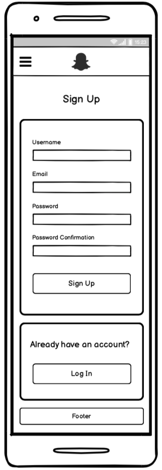

# Sydney Paranormal

A website to register the occurence of paranormal activities in the city of Sydney, Australia. 

## Links

Deployed app: https://sydney-paranormal.netlify.app/

GitHub Repository: https://github.com/Nictordan

## Local Setup Instructions - Backend

- Clone the `sydney-paranormal-api` repository.
- Run `$ gem install bundler` (if you don't have the package manager Bundler installed).
- Run `$ yarn install --check-files`
- Run `$ bundle` to install all of the required dependencies for the project, as described in the `Gemfile`.
- Make sure you have PostgreSQL installed as it is the database management system used in this project.
- Run `rake db:setup` to create a local database of the project and seed pre-defined data.
- Run `rails s -p 4000` to load the Rails server using port 4000. This is because the frontend is set to run at port 3000.
- In the browser, load `http://localhost:4000` to run the app.
- Finally, the code was written in Ruby 2.7.2 In case the project fails to load correctly because of a mismatch between versions, please make sure to use version 2.7.2. 

## Local Setup Instructions - Frontend

- Clone the `sydney-paranormal-client` repository.
- Run `yarn install`to install all of the required dependencies.
- Run `yarn start:local` to load the server.
- In the browser, load `http://localhost:3000` to run the app.

**Important**: The app uses Mapbox, an API for creating interactive maps. In order to load the map properly, it is necessary to obtain an API key from Mapbox; once you sign up a public key will be generated. In the React app, create a `.env` file in the root directory and insert the following line of code. 

```javascript
// make sure that there are no spaces between the = sign.
// do not include quotation marks around the API key.
REACT_APP_MAPBOX_KEY=your_api_key
```

A detailed explanation of how to work with the Mapbox platform, as well as customize the map, can be found further in the documentation.

---

## Purpose & Problem

Currently there is a limited ability for those who have witnessed strange events to share their story, and connect with other's who might be burdened with a similar tale. The purpose of this website is to make a centralised depository of supernatural events, where a user may log such activity, and search through the events logged by other users. Further corroborating sightings can be contributed for any given event, thereby strengthening the veracity of the claims made. In addition for those seeking answers to their experiences, it is also suitable for those amateur investigators of the paranormal as a tool for staying updated.

## User Stories

- As a witness to something strange, I wish to be able to tell as many people about it as I can.
- As a witness to something strange, I wish to have a way of saving my story for posterity.
- As a witness to something strange, I want a way to see if others have experienced the same thing, so I know I'm neither crazy, nor alone.
- As an investigator of the paranormal, I wish there was a way for people to link similar sightings in different locations, so I may form a fuller picture.
- As an investigator of the paranormal, I wish there was a repository of paranormal events which logged sightings in detail, so that I may know where I'm best to concentrate my efforts.

## Available Features

In line with the user stories, Sydney Paranormal currenty supports a limited set of features:

- Users can sign up with a username and email, both being unique. Passwords are encrypted by default.
- Users can log in and log out.
- When logged in, the user's username appears on the home page after a page refresh.
- Users can find instructions about the platform by clicking on the hamburger menu in the navigation bar.
- Users can visualize all registered paranormal activities in the interative map, as indicated by pins (location markers).
- Users can register a new paranormal event by filling a form. The form requires a title, description, and the address where the event happened (i.e. street, suburb, state, and country). 
- **Important:** The added pin shows up on the map after a page refresh.
- When a given pin is clicked, a pop-up display appears on top of the pin, which shows both the title and description of the event, as well as a button that redirects to a page containing notes about the event at hand. If a pin doesn't have any notes attached to it, users can create one.
- Users can leave comments about the notes related to a given pin.

## Target Audience

There are two primary, although not necessarily mutually exclusive, audiences. The initial audience consists of folk who have witnessed some type of paranormal activity. This application doesn't target those who for whatever reason have a large outreach, whether it be through TV or radio; rather, it targets simple every day folk who have unwittingly stumbled into something that defies their day to day experiences. There currently does not exist any service which provides a systematic and streamlined way of getting their stories heard.

The other primary target consists of people who may not have actually witnessed anything paranormal directly themselves, but rather involved as keen investigators of the field. These can be ghost hunters, exorcists, cryptozoologists and renegade FBI agents searching for the truth out there.

## Tech Stack

- HTML: Markup language to structure a website.
- CSS: Markup language to style HTML content.
- JavaScript: Programming language to create interactivity in websites.
- ReactJS: A JavaScript framework for creating user interfaces.
- Material UI: A library for ReactJS created by Google with a view of standardising user interface layouts for consistency and accessibility.
- Mapbox: API for implementing interactive maps.
- Ruby on Rails: Back-end framework for the Ruby programming language.
- PostgreSQL: Relational database management system.
- Heroku: Deployment platform for the server side, which is the industry standard for a Ruby on Rails application.
- Netlify: Deployment platform for the client side of the application.
- Git / GitHub: Technologies used for version control.
- Trello: Project management platform.


# Dataflow Diagram


# Application Architecture Diagram


# Wireframes

## Home Page


## Activities Management Page


## User Profile Page


## Edit User Profile Page


## Account Settings Page


## Log In Page


## Sign Up Page





# Trello Board


